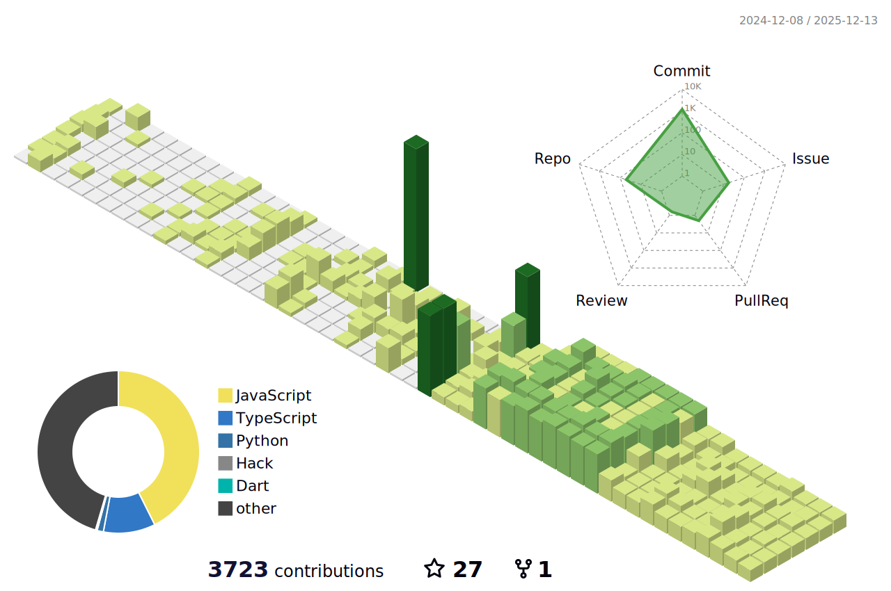
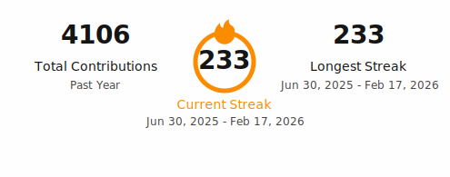

<h1 align="center">
  
</h1>

  
  
  
  
  

---

## About

I’m a Mobile App Developer with 7+ years of experience across full-stack engineering and trading-system development. I build high-performance iOS/Android apps (Swift, Kotlin, Flutter) and the backend + infra behind them (Node.js, AWS, Firebase). I also ship automation and analytics pipelines that combine live market data with AI-driven decision support.

## Skills

  
<strong>Mobile · Full-stack · Trading systems · Applied AI</strong>

### Mobile

  

### Full-stack

  

### Trading / Data

  

### Cloud / DevOps / AI

  

## Focus

- **Mobile**: Swift / Kotlin / Flutter, performance, reliability, clean architecture
- **Backend & Infra**: Node.js, AWS, Firebase, scalable APIs + observability
- **Trading & Automation**: market-data ingestion, execution workflows, risk-aware systems
- **AI in production**: practical LLM integrations, tools/agents, workflow automation

## Highlights (quick scan)

- **End-to-end delivery**: product → architecture → implementation → deployment
- **Performance-minded**: profiling, efficient data flows, and robust state management
- **Systems thinking**: correctness, monitoring, failure modes, and iteration speed

## Stats & visuals

  <picture>
    <source media="(prefers-color-scheme: dark)" srcset="./profile-3d-contrib/profile-night-rainbow.svg" />
    
  </picture>

  <picture>
    <source media="(prefers-color-scheme: dark)" srcset="./profile/streak-dark.svg" />
    
  </picture>

---

## Contact

## Repo notes

This repo auto-updates profile assets via GitHub Actions:

- **3D contributions**: `.github/workflows/profile-3d.yml` → writes to `profile-3d-contrib/`
- **Streak cards**: `.github/workflows/streak-stats.yml` → writes to `profile/`

