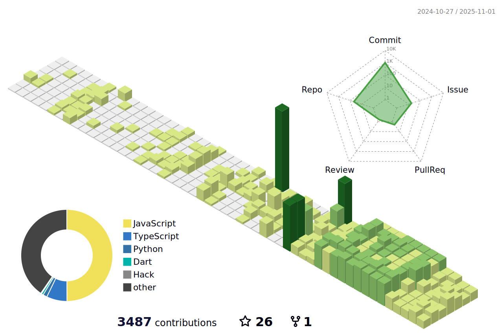

<h1 align="center">
  
</h1>

  
  
  
  
  

---

## About

I’m a Mobile App Developer with 7+ years of experience across full-stack engineering and trading-system development. I build high-performance iOS/Android apps (Swift, Kotlin, Flutter) and the backend + infra behind them (Node.js, AWS, Firebase). I also ship automation and analytics pipelines that combine live market data with AI-driven decision support.

## Skills

  
<strong>Mobile · Full-stack · Trading systems · Applied AI</strong>

### Mobile

  

### Full-stack

  

### Trading / Data

  

### Cloud / DevOps / AI

  

## Focus

- **Mobile**: Swift / Kotlin / Flutter, performance, reliability, clean architecture
- **Backend & Infra**: Node.js, AWS, Firebase, scalable APIs + observability
- **Trading & Automation**: market-data ingestion, execution workflows, risk-aware systems
- **AI in production**: practical LLM integrations, tools/agents, workflow automation

## Highlights (quick scan)

- **End-to-end delivery**: product → architecture → implementation → deployment
- **Performance-minded**: profiling, efficient data flows, and robust state management
- **Systems thinking**: correctness, monitoring, failure modes, and iteration speed

## Stats & visuals

  <picture>
    <source media="(prefers-color-scheme: dark)" srcset="./profile-3d-contrib/profile-night-rainbow.svg" />
    
  </picture>

  <picture>
    <source media="(prefers-color-scheme: dark)" srcset="./profile/streak-dark.svg" />
    
  </picture>

---

## Contact

## Repo notes

This repo auto-updates profile assets via GitHub Actions:

- **3D contributions**: `.github/workflows/profile-3d.yml` → writes to `profile-3d-contrib/`
- **Streak cards**: `.github/workflows/streak-stats.yml` → writes to `profile/`

<!--START_SECTION:chessStats-->
<!-- Automatically generated with https://github.com/Balastrong/chess-stats-action -->

| Type | Rapid ⏲️ | Blitz ⚡ | Bullet 🔫 |
|:---:|:---:|:---:|:---:|
| Current | 1472 | 1328 | 1111 |
| Best | 1655 | 1719 | 1460 |

| White ⚪ | Black ⚫ | Result 🏆 | Date 📅 | Position 🗺️ | Type 🕕 |
|:---:|:---:|:---:|:---:|:---:|:---:|
| **Zeus** | ramafi52 | resigned ❌ | 27/1/2026 | <a href="http://www.ee.unb.ca/cgi-bin/tervo/fen.pl?select=8/p1p2pk1/1p4p1/4Pq2/2P2P2/3rB1P1/P7/4b1K1 w - - 0 33">Link</a> | Blitz |
| **Zeus** | florentino543210 | checkmated ❌ | 27/1/2026 | <a href="http://www.ee.unb.ca/cgi-bin/tervo/fen.pl?select=2r1k2r/pb1pb1pp/1p3n2/1Np5/2B2Bq1/6PK/PP5P/2Q1R3 w - - 2 23">Link</a> | Blitz |
| Spencer-Chess3000 | **Zeus** | resigned ❌ | 26/1/2026 | <a href="http://www.ee.unb.ca/cgi-bin/tervo/fen.pl?select=8/5pk1/5Qp1/6K1/1p4P1/1P6/8/4b3 b - - 0 50">Link</a> | Blitz |
| **Zeus** | Tarragon84 | resigned ❌ | 25/1/2026 | <a href="http://www.ee.unb.ca/cgi-bin/tervo/fen.pl?select=r1b5/ppkp3p/4p1p1/1q4N1/1n2P3/8/PP1N1PPP/2KR3R w - - 4 18">Link</a> | Blitz |
| Dogcry | **Zeus** | repetition ⏸️ | 25/1/2026 | <a href="http://www.ee.unb.ca/cgi-bin/tervo/fen.pl?select=8/8/8/7K/6p1/5k2/7P/8 w - - 9 58">Link</a> | Blitz |
| Kalmareno | **Zeus** | resigned ❌ | 25/1/2026 | <a href="http://www.ee.unb.ca/cgi-bin/tervo/fen.pl?select=k2B1Q2/pb1p3p/1pn3p1/8/7P/4q3/1PP3P1/1K1R1B1R b - - 2 24">Link</a> | Blitz |
| BlitzBomber86 | **Zeus** | checkmated ❌ | 25/1/2026 | <a href="http://www.ee.unb.ca/cgi-bin/tervo/fen.pl?select=2k5/2Q2pbp/1p4p1/p4qP1/1N1P4/1PP2bB1/KP5P/8 b - - 0 30">Link</a> | Blitz |
| **Zeus** | NazmiHalilaj | resigned ❌ | 25/1/2026 | <a href="http://www.ee.unb.ca/cgi-bin/tervo/fen.pl?select=1n5k/3r2p1/p3r2p/1p1Bq3/2P4Q/1P4P1/P4P1P/3R2K1 w - - 0 26">Link</a> | Blitz |
| CC-MATTJUGGS | **Zeus** | resigned ❌ | 25/1/2026 | <a href="http://www.ee.unb.ca/cgi-bin/tervo/fen.pl?select=2kr2nr/pbpq2b1/1pnp3p/5B2/1P1P3N/P1P4p/3N1PPB/R2QR1K1 b - - 0 16">Link</a> | Blitz |
| **Zeus** | sameAkkan | win 🥇 | 25/1/2026 | <a href="http://www.ee.unb.ca/cgi-bin/tervo/fen.pl?select=6nr/4bpp1/4pkb1/1p1p2Q1/8/3P1N1P/PPP2P2/RN2K2R b KQ - 2 20">Link</a> | Blitz |

<!--END_SECTION:chessStats-->