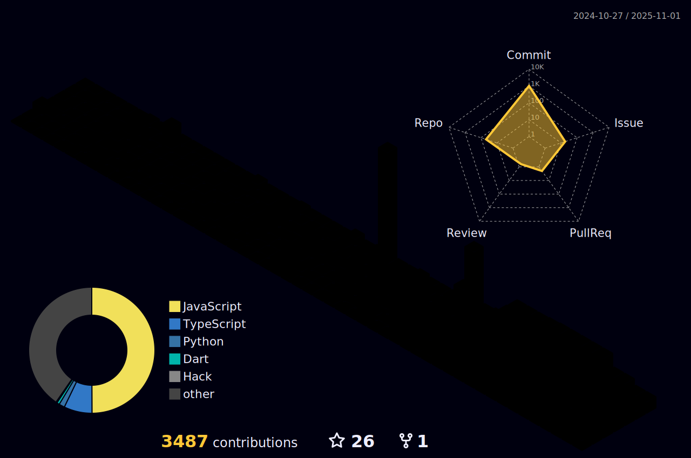

&nbsp;

  

<h1 align="center">
  
</h1>

## 👋 Introduction

Hi, I’m Haruki Mizuno, a Mobile App Developer with over 7 years of experience in full-stack engineering and trading system development. I began my career building scalable web and backend infrastructures using Node.js, AWS, and Firebase, before expanding into mobile development, where I specialize in crafting high-performance iOS and Android applications with Swift, Kotlin, and Flutter. In addition to mobile apps, I’ve developed automated trading platforms that integrate live market data, AI-driven analytics, and automation APIs, enabling smarter decision-making and faster execution. I’m passionate about combining mobile innovation, intelligent architecture, and emerging AI technologies to deliver applications that are not only fast and reliable but also insight-driven and future-ready.

## 📬 Contact

- `Portfolio`: https://harukimizuno.vercel.app
- `Email`: mizunoharuki0624@gmail.com
- `WhatsApp`: +1 (802) 771-7967
- `Calendar`: https://calendly.com/harukimizuno0222
- `LinkedIn`: https://www.linkedin.com/in/haruki-mizuno-6310a6365/
- `GitHub`: http://github.com/0x0zeus
- `Telegram`: @ChainCodeDev219
- `Discord`: @haruki0624mizuno

## 🏆 Achievements & Metrics

  

  

